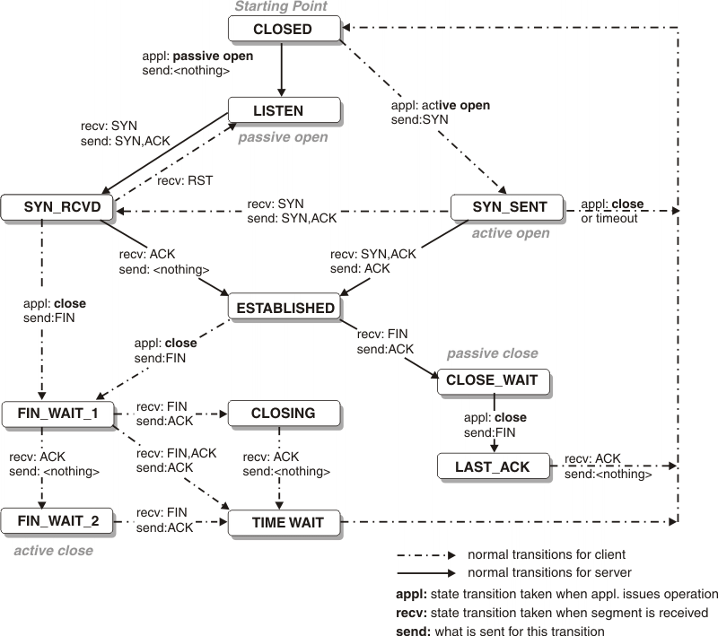

# Go 语言

## Go 介绍

### Go 语言的背景

- **Ken Tompsom** (B/Unix/C 发明人)
- **Rob Pike**(罗布·派克) Unix退队，Plan 9 OS 成员，创造 UTF-8 字符编码, 1980奥运会射箭银牌，天文学家，演讲家
- **Rober Griesemer**: 协助 Java HotSpot 编译器，Chrome 浏览器的 JavaScript 引擎 V8

### 为什么创造 Go 语言

- 计算机硬件技术更新频繁，性能提高很快。目前主流的编程语言发展明显落后于硬件，不能合理利用**多核多CPU**的优势提升软件系统性能。现有的编程语言：1. 风格不统一；2. 计算能力不够；3. 处理大并发不够好
- **软件复杂度越来越高，维护成本越来越高**，目前缺乏一个足够简洁高效的编程语言
- 企业运行维护很多 C/C++ 项目，C/C++ 程序运行速度虽然很快，但是**编译速度很慢**，同时还存在**内存泄露**的一系列困扰需要解决

### Go 语言发展史

- 2007，三大牛人开始设计
- 2009-11-10, 开源 Go 语言源码
- 2015-9-19, Go 1.5 版发布，移除了最后参与的C代码
- 2017-2-17，Go 1.8
- 2017-8-24, Go 1.9
- 2018-2-16, Go 1.10

### 什么是 Go 语言

> 2009年由 Google 公司开发出的开源编程语言 GoLang。金花鼠(gordon, Rob Pike老婆设计的)

- 高性能
- 开发效率

### 为什么使用 Go 语言

- 脚本语言开发速度
- `C/C++` 运行速度
- 支持并发编程
- 为**大数据、微服务，高并发**而生的通用编程语言

### Go 特性

- 静态类型语言的**安全和性能**，又是动态语言**开发维护**的高效率
  - Go = C + Python
  - C 静态语言编程的**运行速度**，又能达到 Python 动态语言的**快速开发**
  - 继承 C 语言的理念：**表达式语法，控制结构，基本数据类型，调用参数值，指针**等等，也保留了和 C 语言一样的编译执行方式及弱化的指针。
  - 引入包的概念，用于组织程序结构，Go 语言的**一个文件都要归属于一个包**，而不能单独存在
- **垃圾回收**
  - 内存自动回收，不需要 developer 管理内存
  - 专注业务实现
  - 只需要 `new` 分配内存，不需要释放
- **不需要依赖库**
  - C 依赖库：`ldd hello_c`列出hello_c文件依赖哭
- **并行**(并发处理能力)、**开源**
  - 从语言层面支持并发，非常简单
  - `goroute`, 轻量级线程，创建成千上万个 `goroute` 成为可能
  - 基于 `CSP` (Communicating Sequential Process) 模型实现
- 管理通信机制，形成 Go 语言特有的管道 **channel**
  - 管道，类似 `Unix pipe`
  - 多个 `goroute` 之间通过 `channel` 进行通信
  - 支持任何类型
  - `pipe := make(chan int, 3)` 定义3个int型管道
  - `pipe <- 1` 1 放到管理 pipe
  - `pipe <- 2` 2 放到管道 pipe
- 内存管理、**数组安全、编译迅速**

### GoLang 学习方向

- 区块链研发
- 游戏开发(数据通道)
- 服务器端开发(数据处理/大并发)
- 软件开发(分布式/云计算)
  - 盛大云 cdn
  - 京东云

### GoLang 应用领域

- 区块链应用(Blockchain technology)： 分布式账本技术，一种分布式数据库技术
  - 去中心化
  - 公开透明
  - 每个人可参与数据库记录
- 后端服务器应用
  - 美团后台流量支持程序
    - 计算能力：支撑主站后台流量（排序，推荐，搜索等）
    - 大并发能力
      - 提供负载均衡
      - cashe
      - 容错
      - 按条件分流
    - 统计运行指标(GQS, latency) 等功能
  - 仙侠道
    - 游戏服务器（通讯、逻辑、数据存储）
- 云计算/云服务后台应用
  - 盛大云CDN
    - [盛大云计算](http://www.grandcloud.cn/)
    - 应用范围：CDN的调度系统、分布系统、监控系统、短域名服务、CDN内部开放平台、运营报表系统以及其他一些小工具等
  - 京东消息推送云服务/京东分布式文件系统
    - 京东云
    - 应用范围：后台所有服务全部用 go 实现

### Go 目前的应用软件

- Docker
- Kubernet
- Caddy
- Codis(豆瓣)
- Glow(类似于 Hadoop)
- Cockroach(蟑螂) 数据库

### 使用 Go 语言公司

- Google
- AWS
- Cloudflare
- CoreOS
- 百度
- 阿里
- 滴滴
- 七牛云
- 小米
- 京东

### 计算机语言学习方法

1. 项目需求（局部刷新）
2. 解决方案
  - 传统方法 `iframe`
  - 使用新技术 `ajax`

3. 掌握新技术

  - 原理
  - 基本语法

4. 快速入门新技术
  - 安装环境
  - 基本使用

5. **深入新技术**
  - 使用规范
  - 使用陷阱
  - 使用注意点

6. 解决项目需求

## Go 语言环境搭建

### Go SDK

> Go SDK: Go 语言开发工具包。包括编译、运行和API等

[下载安装 Go SDK](https://studygolang.com/dl)

- go1.9.2 darwin-amd64.pkg: Mac 下的 SDK 图像化安装包
- go1.9.2 darwin-amd64.pkg

- go1.9.2.freebsd-amd64.tar.gz: Unix 下的 SDK

- go1.9.2.linux-amd64.tar.gz: Linux 下的 SDK
- go1.9.2.src.tar.gz: 源码

- go1.9.2.windows-amd64.zip: Windows 下的 SDK

### 安装方式 

1. 源码安装
2. `Go` 标准包安装
3. 第三方工具安装，比如 `GVM`

### gopath 环境变量

> GOPATH：为我们开发常用的目录，建议不要和 Go 的安装目录一致

- `GOROOT`: SDK 安装目录
- `Path`: 添加 SDK 的 `/bin` 目录
- `$GOPATH` 工作目录（Go项目的工作路径）：目录约定有三个子目录
  - `src` 存放源代码（比如：.go, .c, .h, .s等）
    - github.com(网站域名) | 公司代码仓库域名(code.wovert.com)
      - 作者/机构(wovert) | 公司内部组织架构(前段组，后端组)
        - 项目1(项目名)
          - 模块A
          - 模块B
        - 项目2
    - gopkg.in
    - golang.org
  - `pkg` 编译后生成的文件(.a文件)（非main函数的文件在go install后生成）
  - `bin` 存放编译后生成的可执行文件（为了方便，可以把此目录加入到 `$PATH` 变量中）

- `GOBIN`：是 `GOPATH` 下的 `bin` 目录
- `Path`：环境变量，需要 `go-bin` 目录加入到 `path` 路径下，生成可执行文件就可以直接运行了

**可执行文件只有一个`main` 函数的文件**

### windows 安装及配置

1. 下载 go1.9.2.windows-amd64.zip
2. 安装路径不要有中文或者特殊符号如空格等
3. SDK 安装目录建议：`E:/usr_local`
4. 安装时，基本上是傻瓜式安装，解压就可以使用

- go
  - bin
    - go.exe 编译和运行 go 源码
    - godoc.exe
    - gofmt.exe

```cmd
检测 SDK 是否安装成功
E:usr_local\go\bin> go version
```

#### Windows 下配置环境变量

> 当前进程设置 GOPATH 环境变量

```cmd
d:\> go version
'go' 不是内部或外部命令，也不是可运行的程序或批处理文件
```

错误分析：当前执行的程序在当前目录下不存在，Windows OS 会在系统中已有的一个名 `path` 环境变量指定的目录中查找。如果仍未找到，会出现以上的错误提示。所以进入到 `go` 安装路径 `\bin` 目录下，执行 `go`，会看到 `go` 参数的提示信息

1. 我的电脑 -> 属性 -> 高级系统设置 -> 环境变量 -> 系统变量 -> 编辑 Path
2. 拷贝 Go SDK 安装目录 `E:\usr_local\go` 到 `GOROOT` 环境变量中
2. `%GOROOT%\bin`添加到 `PATH` 环境变量中
3. go 工作目录 `E:\goProject` 添加到 `GOPATH` 环境变量中

测试环境变量
``` cmd
> echo %GOPATH%
> go get github.com/astaxie/beego
```

- `go get` 的本质就 `git` + `go install`
- `go get github.com/beego/bee`
  - `go get github.com/beego/bee` 映射至 `$GOPATH/src/github.com/beego/bee`

### Linux 安装及配置

1. 查看 Linux 位数版本 `uname -a`
2. 下载 SDK go1.9.2.linux-adm64.tar.gz
3. 复制到 `/opt` 目录下
4. 解压文件 `tar -zxvf go1.9.2.linux-adm64.tar.gz`
5. 配置环境变量

```sh
# vim /etc/proile.d/go.sh
  export GOPATH=/opt/go
  export PATH=$PATH:$GOPATH/bin
  export GOPATH=$HOME/goProjects/
# source /etc/profile.d/go.sh
# go version
```

### mac 安装及配置

1. 下载 go1.9.2.darwin-amd64.tar.gz
2. 复制到 `用户目录/go_dev/go`
3. 剩下与 Linux 安装方式一样

```sh
$ brew install go
$ go version
$ vim ~/.bash_profile
  我的源码库没有跟安装目录放在一起
  1）单源码库环境变量配置
  export GOPATH=/Applications/MAMP/htdocs/go
  export GOBIN=$GOPATH/bin
  export PATH=$PATH:$GOBIN
  2）多源码库环境变量配置
  export GOPATH=/Applications/MAMP/htdocs/go(:自由添加目录，其他不变)
  export GOBIN=$GOPATH/bin
  export PATH=$PATH:${GOPATH//://bin:}/bin
$ source ~/.bash_profile
```

### Go 语言的开发工具

- VS Code
- IntelliJ IDEA 注册码：http://idea.lanyus.com/
- LiteIDE
  - Go 语言开发的跨平台轻量级继承开发环境(IDE)
- GoLand (类似 Pycharm), Eclipse, Intelli Idea等

#### 在 Linux OS 安装 vscode

1. 下載 code-stable-codexxxx.amd64.tar.gz
2. 文件复制到 `/opt` 目录下
3. 解压文件 `tar -zxvf code-stable-codexxxx.amd64.tar.gz`
4. 进入解压后的目录运行vscode 程序 `./code`

#### 在 Mac OS 安装 vscode

```sh
启动 sshd 服务
$ sudo launchctl loadl -w /System/Library/LaunchDaemons/ssh.plist

停止 sshd 服务
$ sudo launchctl unload -w /System/Library/LaunchDaemons/ssh.plist

查看是否启动
$ sudo launchctl list | grep ssh

显示 0 com.openssh.sshd 代表启动成功了

解压
$ unzip VScode-darwin-stable.zip
```

### 调试工具delve 安装

- mac : `brew install go-delve/delve/delve`
- linux&windows: `go get github.com/derekparker/delve/cmd/dlv`

## 程序

> 指令的集合

文件编码必须是 `utf-8`

``` shell
编译
$ go build hello.go

编译运行
$ go run hello.go
```

### go 命令行

- go get : 获取远程包（需提前安装 git 或 hg）
- go run : 直接运行程序
- go build : 测试编译、检查是否有编译错误
- go fmt : 格式化源码
- go install : 编译包文件并编译整个程序
- go test : 运行测试文件
- go doc : 查看文档 

## 快速入门

### 开发步骤

1. 目录结构

- E:\goProject 工作目录
  - src 源码
    - go_code
      - project1
        - main
        - package
      - project1

2. 创建 demo 文件 `vim project1/main/hello.go`

```cgo
package main // 文件归属 main 包
import "ftm"
func main() {
  fmt.Println("hello World")
}
```

3. 通过 `go build hello.go` 命令对 go 文件进行编译，生成 .exe 文件

**生产环境必须先编译**

```sh
# cd project1/main
# go build hello.go
# hello.exe
```

4. 通过 `go run hello.go` 命令编译执行程序

**用于开发环境**

```sh
# cd project1/main
# go run hello.go
```

### GoLang 执行流程分析

- 源码编译，在执行，Go执行流程
  - .go文件 ---- `go build`(编译) ---> 可执行文件 ---- 运行 ----> 结果

- 源码直接执行 `go run`
  - .go文件 ---- `go run`(编译和运行) -----> 结果

#### 执行流程区别

1. 先编译生成可执行文件，可以将可执行文件复制到没有 go 开发环境的机器上可以运行
2. 直接 `go run 源码文件`，如果在另外一个机器上运行，需要 go 开发环境，否则无法执行
3. 在编译时，编译器会将程序运行依赖的库文件包含在可执行文件中，所以可执行文件变大了很多

### 什么是编译

1. 通过编译器将其编译成机器(CPU指令)可以识别的二进制码文件
2. 指定编译输出的文件：`go build -o hi.exe hello.go`

### go 开发注意事项

- 源文件必须以`.go` 扩展名
- 应用程序的执行入口是 `main()`方法
- 严格区分大小写
- 每个语句后不需要分号（自动加分号(`;`)）
- Go 编译器逐行进行编译的，因为每行写一条语句，不能把多条语句写在同一个，否则报错
- 定义的变量或者 `import` 的包没有使用，那么代码不能编译通过
- 大括号都是成对儿出现的，缺一不可

### 注释

- `// 行注释`
- `/* 块注释 */`

### 规范代码风格

- Shift + Tab
- `gofmt` 进行格式化
  - `gofmt -w hello.go`

## 基础语法

### 常用关键字

`break default func interface select case defer go map struct chan else goto package switch const fallthrought if range type continue for import return var`

### 标识符

> 变量、方法和函数等命名时使用的字符序列称为标识符。字母和下划线开头，大小写敏感，后跟字母和数字和下划线

`_` 是特殊标识符，用来忽略结果

- 标识符规范
  - 包名与目录名保持一致
  - 变量名、函数名、常量名采用驼峰法
  - 变量名、函数名、常量名首字母大写，则可以被其他的包访问；如果首字母小写，则只能在本包中使用

### 包管理

> 把相同功能的代码放到一个目录，称之为包

- 包可以别其他包引用
- `main` 包是用来生成可执行文件，每个程序只有一个 `main` 包
- 包的主要用途是提高代码的可复用性

`package <pkgName>`

- 10calc
  - package calc

```go
import (
  // 别名 包路径
  bieming "code.wovert.com/10calc"
)
```

`init()`初始化函数

```go
import (
  // 导入包是调用包的init()函数
  // _ 不使用包内部的标识符，需要匿名导入
  _ "code.wovert.com/10clac"
)
```

- 全局声明 -> init() -> main()

### var 关键字

```go
var num int

// 简写形式只能在函数体内使用: 自动推到类型（同一个变量只是使用一次，用于初始化那次）
y,z := 100, "world"
fmt.Printf("%d, %s", y, z)
```

### const 常量

``` go
const PI = 3.14
const hello string = "wovert"

// 批量声明常量时，某一行声明后没有赋值，默认就和上一行一致
const (
  n1 = 100
  n2 // 100
  n3 // 100
)
```


### 变量

> 内存中一个数据存储空间

- 变量存储
  - 等号左边的变量，代表变量所只想的内存空间（写）
  - 等号右边的变量，代表变量内存空间存储的数据值（读）

1. 声明变量
2. 变量赋值
3. 使用变量

- 声明变量之后，没有赋值会使用默认值(`int=0, string=""`)
- 变量类型写在变量名之后
- 编译器可推测变量类型
- 没有 `char`, 只有 `rune`
- 原生支持复数类型
- 该数据内类的值可以在同一类型范围内不断变化
- 变量在同一个作用域内不能重名
- 变量 = 变量名 + 值 + 数据类型
- 非全局变量声明后必须使用，不使用就不能编译通过
- 函数外的每个语句都必须以关键字开始(`var, const, func`等)

### 声明变量方式

1. 全局声明方式：批量声明方式

```cgo
var (
  name = "wovert"
  age = 30
)
```

2. 声明变量同时赋值

```cgo
var name string = "wovert"
```

3. 类型推导（根据值判断该变量是什么类型）

```cgo
var name = "wovert"
```

4. 简短变量声明

:= 不能使用在函数外
```cgo
name := "wovert"
```

5. 匿名变量：不占用命名空间，不会分配内存

- 全局声明方式：批量声明方式，_多用于占位，表示忽略值
```cgo
x, _ := foo()
```

### iota

> 常量计数器

- const 关键字出现时将被重置为0
- const 中每新增一行常量声明将 iota 计数一次(iota可以理解为const语句块中的行索引)


```cgo
const (
  n1 = iota // 0
  n2 // 1
  n3 // 2
  n4 // 3
)
```

## 数据类型

### 基础数据类型


| 类型 | 名称 |	长度 |	默认值 |说明|
| --------   | -----:   | :---- | :---- | :----: |
| bool | 布尔类型| 1|false|true/false 不可以用数字代表|
| byte| 字节型| 1 | 0 | uint8 别名 |
| rune | 字符型 | 4 | 0 | 专用于存储 unicode 编码，等价于uint32 |
| int, uint | 整型 | 4 or 8 | 0 | 32 bit or 64 bit |
| int8, uint8 | 整型 | 1 | 0 | -128 ~ 127, 0 ~ 255 |
| int16, uint16 | 整型 | 2 | 0 | -32768 ~ 32767, 0 ~ 65535 |
| int32, uint32 | 整型 | 4 | 0 | -21亿 ~ 21亿, 0 ~ 42亿 |
| int64, uint64 | 整型 | 8 | 0 | |
| float32 | 浮点型 | 4 | 0.0 | 小数位精确到 7 位 |
| float64 | 浮点型 | 8 | 0.0 | 小数位精确到 15 位 |
| complex64 | 符合类型 | 8 |  |  |
| complex128 | 符合类型 | 16 |  | |
| uintptr | 整型 | 4 or 8 | | 存储指针 uint32 or uint64 整数  |
| string | 字符串 | | "" | utf-8 字符串 |

### fmt 包的格式化输出输入

| 格式 | 含义 |
| ---- | :----: |
| %% | %字面量 |
| %b | 二进制整数值（基数为2）或者是科学计数法表示的指数为2的浮点数 |
| %d | 十进制数值（基数为10） |
| %e | 科学计数法表示的浮点数或者复数值 |
| %E | 科学计数法表示的浮点数或者复数值 |
| %f |浮点数或者复数值 |
| %g | %e或者%f表示的浮点数或者复数，任何一个都以最为紧凑的方式输出 |
| %G | %E或者%f表示的浮点数或者复数，任何一个都以最为紧凑的方式输出 |
| %o | 八进制整数值 |
| %p | 十六进制表示的一个值的地址。前缀为0x后跟小写的a-f表示 |
| %s | 字符串 |
| %t | true/false |
| %T | 值得类型 |
| %#v | 默认格式输出的内置或者自动移类型的值，或者是使用其类型的 String()方式输出的自定义值，如果该防范存在的话 |
/ %% | %|
| %U | Unicode 表示整数码点，默认值为4个数字字符 |
| %x | 16进制整数值 a-f |
| %X | 16进制整数值 A-F |

### 类型转换

- 不允许隐式转换，**所有类型必须显式声明**，而且转换只能两个相互兼容的类型之间
- bool 与 整型不能相互转换
- 0就是假，非0就是真
- 字符类型本质就是整型

### 类型别名

```cgo
// int64 类型改名为bigint
type bigint int64
var x bigint = 100

type (
  myint int // int 改名为 myint
  mystr string // string 改名为 mystr
)
```

### 整数值

- 默认声明未 int 类型

### 浮点型

- 浮点数 = 符号位 + 指数位 + 尾数位
- 有固定的范围和字段长度，不受具体 OS 的影响
- 默认声明未 float64 类型
- float32类型的值不能直接赋值给float64类型的变量

### 字符类型

- 字符型存储到计算机中，需要将字符对应的码值（整数）找出来
  - 存储：字符->对应码值->二进制->存储
  - 读取：二进制->码值->字符->读取
- Go 语言的编码都统一使用 `utf-8`

### 布尔类型

- 占一个字节
- bool 取值范围：`true | false`，不能使用0或非0
- 不允许将整数强制转换为布尔型
- 无法参与数值运算，也无法与其他类型的进行转换

### 字符串类型

- 使用 UTF-8 编码标识 Unicode 文本
- 字符串一旦赋值，就不能修改。**字符串是不可变的**
- "会识别转义字符"
- `反引号，已字符串的原生形式输出，包括换行和特殊字符，可以实现防止攻击、输出源代码等效果`
- 字符串拼接换行时，`+` 保留在行尾


#### 基本数据类型转换

- 必须显示转换，不能自动转换
T(v)

```cgo
var i int32 = 257
var n1 float32 = float32(i)
var n2 int8 = int8(i)
var n3 int64 = int64(i)
var n4 byte = byte(i)
fmt.Printf("i=%v n1=%v n2=%v n3=%v n4=%v\n", i, n1, n2, n3, n4)
fmt.Printf("i=%T \n", i)
```

- 范围小的可以转换为范围大的，也可以范围大的转换为范围小的
- 被转换的是变量存储的数据，变量本身的数据类型并没有变化
- `int64` 转换成 `int8`，编译时不会报错，只是转换的结果是按**溢出**处理

### 复合类型

| 类型 |名称 | 长度 |默认值 | 说明 |
| ---: | :--- | :---- | :----  | :---: |
| pointer | 指针 | |nil |  |
| array | 数组 |  | 0 | |
| slice | 切片 |  |nil | 引用类型 |
| map | 字典或映射 |  |nil | 引用类型 |
| struct | 结构体 |  | nil | |


- 派生/复杂数据类型
  - 指针
  - 数组
  - 结构体
  - 管道
  - 函数
  - 切片
  - 接口
  - map


## file

### 文件分类

- 设备文件
  - 屏幕（标砖输出设备）fmt.Println() 往标准输出设备写内容
  - 键盘（标砖输入设备）ftm.Scan() 从标准输入设备读取内容
- 磁盘文件：存储设备上的文件
  - 文本文件：以记事本打开，能看到内容（不是乱码）
  - 二进制文件：以记事本打开，能看到内容（乱码）
  
为什么需要文件？内存掉电丢失，程序结束，内存中的内容小时；文件放磁盘，程序结束，文件还是存在

### 文件接口

- 建立
  - `Create(name string)(file *File, err Error)`
    - 创建文件：文件不存在创建，存在，则将文件内容清空
  - `NewFile(fd uintptr, name string) *File`
- 打开: 以只读、读写方式打开文件，文件不存在，打开失败
  - `Open(name string)` 以只读方式打开文件，文件不存在，打开失败
  - `OpenFile(name string, flag int, perm uint32) (file *File, err Error)`
    - name: 打开文件的路径；绝对路径；相对路径
    - 打开文件权限：O_RDONLY, O_WRONLY, O_RDWR
    - 一般传6或7
- 写文件
  - `Write(b []byte) (n int, err Error)`
  - `WriteAt(b []byte, off int64) (n int, err Error)`
    - 按字节写：在文件制定偏移位置，写入 []byte, 通常搭配 Seek()
    - 1. 待写入的数据
    - 2. 偏移量
    - 返回：实际写出的字节数
    - n, _ = f.WriteAt([]byte("111"), off)
  - `WriteString(s string) (ret int, err Error)`
    - 按字符串写，n个写入的字符个数
    - 回车换行：
      - windows: \r\n
      - Linux: \n
  - `seek(offset int， io.SeekStart | io.SeekCurrent | io.SeekEnd)` 修改文件的读写指针位置
    - 按位置写
    - offset 偏移量，正：向文件尾偏，负：向文件头偏 
    - io.*
      - io.SeekStart 文件起始位置
      - io.SeekCurrent 文件当前位置
      - io.SeekEnd 文件结尾位置
    - 返回值：表示从文件起始，到当前文件读写指针位置的偏移量
- 读文件
  - `Read(b []byte) (n int, err Error)`
  - `readAt(b []byte, off int64) (n int, err Error)`
  - 按行读
    - 1. 创建一个带有缓冲区的 Reader(读写器)
      - `reader := bufio.NewReader(打开的文件指针)`
    - 2. 从reader的缓冲区中，读取指定长度的数据。数据长度取决于参数 dlime
      - `buf, err := reader.ReadBytes('\n') // 按行读`
      - 判断到达文件结尾：`if err != nil && err == io.EOF` 到文件结尾
        - 文件结束标记，是要单独读一次获取到的
  - 缓冲区：内存中的一块区域，用来减少物理磁盘访问操作

- 删除文件
  - `Remove(name string) Error`


1. `os.Create` 文件不存在创建，文件存在，将文件内容清空
2. `open` 打开文件，以**只读**方式打开文件
3. `OpenFile` 以**只读、只写、读写**方式打开文件

资源关闭

``` go
file.Open("file")
defer file.close()
```

### 写文件

- 按字符串写
- 按位置写
- 按字节写

### 读文件

- 按行读
  - 1.创建一个带有缓冲区的 Reader(读写)
  - 2.从reader的缓冲区中，读取指定长度的数据。数据长度取决于参数delime
- 按字节写

## 异常处理

`panic("抛出异常")`

## 在线编辑 go 语言

- golang.org

## init函数

> 每个源文件都可以包含一个 init 函数，这个init函数自动被 go 运行框架调用，main 函数调用之前执行

## 常量

``` go
const idenfifier [type] = value
const (
  a = 0
  b //1
  c //2
)
```

## 值类型和引用类型

- 值类型：`int, float, bool, string, array, struct`
- 引用类型：`pointer, slice, map, chan`

``` go
import (
  _ "add" // 会执行add包的init函数
)
```

## time

- time.Duration 纳秒1000 = 1 Millisecond => Second => Minute => Hour => 
- time.Now()
- time.Now().Format("02/1/2006 15:04:05")
- time.Now().Format("2006/1/02 15:04")
- time.Now().Format("2006/1/02")

## 运算符

- 算符运算符: +(正号, 加, 字符串相加), -(符号, 减), *, /(取整数), %, i++, i--
  - `10 / 4 == 2`
  - `10.0 / 4 = 2.5`
  - `10%-3 == 1` 与除数有关系
  - i++, i-- 必须独立使用
- 赋值运算符: `=, +=, -=, *=, /=, %=`
- 比较运算符/关系运算符: `==, !=, <, >, <=, >=`
- 逻辑运算符: `&&, ||, !`
- 位运算符
- 其他运算符: `&, *`

### 优先级

- 括号, ++, --
- 单目运算符：+,-,!,~, (type), *, &, sizeof **右到左**
- 算符
- 移位
- 关系
- 位
- 逻辑
- 赋值 **右到左**
- 逗号

## 键盘输入语句

- fmt.Scanln()
- fmt.Scanf()

## 流程控制语句

- 顺序控制语句
- 分支控制语句
  - 单分支
  - 双分支
  - 多分支
- 循环控制

- `if a := 1; a < 100 {`
- `switch num := 100; num {`
  - `fallthrough` 与 `break` 相反

```go
switch num :=1; num {
  case 1:
    ...
  case 2, 3, 4:
    ...
  default:
    ...
}

score := 85
switch {
  case socre > 90:
    ...
  case score > 80:
    ...
  default:
    ...
}
```

- range str: 元素索引，元素值

```go
for i := 1; i <= n; i++ {
  ...
}
for i <= n {
  ...
  i++
}
str := "abc"
for i, data := range str {
  // i 元素索引
  // data 元素值
}
// 值返回原素值
for _, data := range str {
  ...
}
// 仅返回元素索引
for i := range str {
  ...
}
```

- break and goto

```go
label:
for ...
  for ...
    break label
```

## 包

- `import` 包时，路径从 `$GOPATH` 环境变量的 `src` 目录开始，编译器自动从 `src` 下开始引入
- 同一个包下，不能有相同的函数名，否则报重复定义

```go
import (
  // 别名
  util "go/tools/utils"
)
```

编译后生成一个有默认名的可执行文件，在 $GOPATH 目录下，可以指定名字和目录 `go build -o bin/my.exe go_code/project/main`

- `pkg/windows_amd64/go_code/project/function/utils.a` 库文件

## 函数

```go
func 函数名(形参列表)(返回值列表) {
  ...
  return 返回值列表
}
```

### 函数的特点

- 不支持重载
- 函数是一等公民，函数可以赋值给变量
- 匿名函数
- 多返回值

无论是值传递，还是引用传递，传递给函数的都是变量的副本，不过，值传递是值的拷贝。引用传递是地址的拷贝，一般来说，地址拷贝更为高效，而值拷贝取决于拷贝的对象大小，对象越大，则性能越低。

- `map, slice, chan, pointer，interface` 默认以引用方式传递

- 命令返回值的名字

### 参数的传递

- 值传递：基本数据类型 int系列, float系列， bool, string, 数组和结构体
- 引用传递: 指针，slice 切片, map, 管道 chan, interface 等都是引用类型

不管是值传递还是引用传递，传递给函数的都是变量的副本，不同的是，值传递的是值的拷贝，引用传递的是地址的拷贝。地址拷贝效率高，因为数据量小，而值拷贝决定拷贝的数据大小，数据越大，效率越低

### 可变参数

```go
// 0个或多个参数
func add(arg... int) int {}

// 1个或多个参数
func add(a int, arg... int) int {
}

// 2个货多个参数
func add(a int, b int, arg... int) int {}
```

其中 `arg` 是一个`slice`, 通过`arg[index]`一次访问所有参数通过`len(arg)`来判断传递参数的个数

```go
func read() {
  mc.Lock()
  defer mc.Unlock()
}

func read2() {
  conn, err := openConn()

  defer func() {
    if err != nil {
      conn.Close()
    }
  }()
}
```

### defer 执行时机

- return 不是原子操作，在底层分为两步来执行

- return x
  - 1. 返回值x(返回值赋值)
  - 2. 运行defer
  - 3. RET指令(RET返回)

### 内置函数

- `close`: 关闭 `channel`
- `len`: 长度，比如 `string, array, slice, map, channel`
- `new`: 分配内存，主要用来分配**值类型**，比如`int, struct`, 返回的是**指针**
- `make`: 分配内存，主要分配**引用类型**，比如`chan, map, slice`，返回的**具体对应的类型**
- `append`: 追加元素到数组，`slice`中
- `panic`和`recover`, 用来做错误处理
  - `recover()`必须搭配`defer`使用
  - `defer` 一定要在可能引发`panic`的语句之前定义

### 函数是数据类型

- 自定义数据类型
  - `type 自定义数据类型名 数据类型`
  - `type myInt int` 给int取了别名，myInt和int都是 int类型，但是go认为是两个不同类型
  - `type mySum func(int, int) int`

- 支持返回值命名

```go
func getSumAndSub(n1 int, n2 int) (sum int, sub int) {
  sum = n1 + n2
  sub = n1 - n2
  return
}
```

### 匿名函数和闭包

```go
sum := func (a int, b int) func () int {
  a *= a
  b *= b
  return func () int {
    return a + b
  }
}
```

- `range str`: 元素索引，元素值
### defer

在函数中需要创建资源（数据库连接、文件句柄、锁等），为了在函数执行完毕后，及时的释放资源，Go 的设计者提供defer(延时机制)

```go
func sum(n1 int, n2 int) int {
  defer fmt.Println("n1=", n1) // 压栈
  defer fmt.Println("n2=", n2) // 压栈
  res := n1 + n2
  fmt.Println("res=", res)
  return res
}
```

- 遇到defer 语句时，不会立即执行 defer 后的语句，而是将 defer 后的语句压入到一个栈中
- 当函数执行完毕之后，再从 defer 栈，**先入后出**的方式出栈（一次从栈顶去除语句执行）
- 在 defer 将语句放入到栈时，也会将相关的值拷贝同时入栈

### 变量作用域

- 局部变量：函数内声明/定义的变量，作用域**仅限于函数内部**
- 全局变量：函数外声明/定义的变量，作用域在**整个包**都有效，如果其**首字母为大写**，则作用域在**整个程序有效**
- 代码块：在 for/if 中，作用域在该代码块中

### 注释事项

- 函数外不能使用 `Name := "tome"`，因为等价 `var Name string Name="tom"`，**赋值语句不能在函数体外**

## 指针

> 指针是一个某个**内存地址的值**。这个内存地址是内存中存储的另一个变量的值的起始位置。Go语言对指针的支持介于 Java 语言和 C/C++ 语言之间，Go 语言没有向 Java 语言那样取消了对指针的直接操作的能力，也避免了 C/C++ 语言中由于对指针的滥用而造成的安全和可靠性问题。

### 栈帧的内存布局

- 栈帧：用来给函数运行提供内存空间，取内存上 stack 上。当函数调用时，产生栈帧，函数调研结束，释放栈帧。
- 栈帧存储
  - 1)局部变量
  - 2)形参（形参与局部变量存储地位等同）
  - 3)内存字段描述值(栈基指针和栈顶指针的位置)

- 栈基指针（调用函数开始） VS 栈顶指针（调用函数结束）

- stack(默认1M, Windows OS 可以扩展到8M, Linux 可以扩展到 16M)
- heap
- .bss(未初始化数据区) RW
- .data(初始化的数据区）RW
- .rodata(只读数据区) RO
- .text(代码区) RO

### Go 语言的指针

> Go 语言保留了指针，但与 C 语言指针有所不同

- 默认值 `nil`
- 操作符 `&` 取变量地址，`*` 通过指针访问目标对象
- 不支持指针运算，不支持 `->` 运算符，直接用 `.` 访问目标成员

指针就是地址，指针变量就是存储地址的变量

*p: 解引用，间接引用

## xorm 操作数据库

```sh
go get github.com/go-xorm/xorm
go get github.com/go-sql-driver/mysql
```

## go get golang.org/x 包失败

- gopm 来获取无法下载的包
```sh
$ go get -v github.com/gpmgo/gopm
$ gopm get -g -v golang.org/x/tools/cmd/goimports
```


Go version >= 1.11
```sh
export GO111MODULE=on
export GOPROXY=https://goproxy.io
go mod ...
Windows 用户，可以在 PowerShell 中设置：

$env:GOPROXY = "https://goproxy.io"
```

```go
// string到int
int, err := strconv.Atoi(string)

// string到int64
int64, err := strconv.ParseInt(string, 10, 64)

// int到string
string := strconv.Itoa(int)

// int64到string
string := strconv.FormatInt(int64,10)
```

## leetcode.com

### 空指针和野指针

- 空指针：为初始化的指针 `var p *int` `*p --> error`
- 野指针：被一片无效的空间初始化 `var p *int = 0`

- `0x000-0xff` 内存地址给操作系统使用

heap 上申请一片内存地址空间

```go
var pStr *string
pStr = new(string)
```

- 变量存储
  - 等号左边的变量，是变量所指向的内存空间(写)
  - 等号右边的变量，是变量内存空间存储的数据值(读)

- 指针的函数传递
  - 传地址（传引用）：将形参的地址值作为函数参数传递
    - 传引用：在A栈帧内部，修改B栈帧中的变量值
  - 传值（数据值）：将实参的值拷贝一份给形参
  

## 字符串函

- 字符串长度(字节): `len(str)`
  - 一个 ascii 占用一个字节
  - 一个汉字占用3个字节
- `str1 := []rune(str)`
- 字符串转整数：`n, err = strconv.Atoi("12")`
- 整数转字符串：`str = strconv.Itoa(1234)`
- 字符串转 []byte: `var bytes = []byte("hello World")`
- []byte转字符串：`str = string([]byte{97,98,99})`
- 10进制转2,8,16进制：`str = strconv.FormatInt(123, 2) // 2->8,16`
- 查找子串是否在指定的字符串中：`bool strings.Contains("seafood", "foo")`
- 统计一个字符串有几个指定的子串：`strings.Count('ceheese', 'e')`
- 字符串比较（不区分大小写）: `bool strings.EqualFold("abc", "Abc")`
  - 区分大小写：`abc == Abc`
- 返回子串在字符串第一次出现的 `index` 值，没有返回 -1: `strings.Index("NLT_abc", "abc")`
- 返回子串在字符串最后一次出现的 `index` 值，没有返回 -1: `strings.LastIndex("NLT_abc", "abc")`
- 子串替换成另外一个子串(n:替换几个,-1替换所有)： `strings.Replace("go go hello", "go", "go 语言", -n)`
- 大小写转换：`strings.ToLower/ToUpper()`
- 字符串分割成字符串数组: `int strings.Split("hello World", ",")`
- 字符串左右两边空格去掉：`strings.TrimSpace(" tn a lone sss...  ")`
- 字符串左右两边指定的字符去掉：`strings.Trim("!Hello!", "!")`
- 字符串左边指定的字符去掉：`strings.TrimLeft("!Hello!", "!")`
- 字符串右边指定的字符去掉：`strings.TrimRight("!Hello!", "!")`
- 是否以某个字符串开头：`strings.HasPrefix("http://www.wovert.com", "http")`
- 是否以某个字符串结尾：`strings.HasSuffix("http://www.wovert.com", ".com")`

## 日期时间相关函数

> time 包

- now := time.Now()
- now.Year()
- now.Month()
- int(now.Day())
- now.Hour()
- now.Minute()
- now.Second()

- 格式化日期时间
  - `dateStr := fmt.Sprintf("%d-%02d-%02d %02d:%02d:%02d \n", now.Year(),now.Month(), now.Day(), now.Hour(), now.Minute(), now.Second())`
  - `fmt.Println(now.Format("2006/01/02 15:04:05"))`

- 时间常量
- 休眠时间: time.Sleep(time.Second)
- 随机时间
  - now.Unix()
  - now.UnixNano()
- 执行代码时间
  - start := time.Now().Unix()
  - test()
  - end := time.Now().Unix()

## 错误处理机制

```go
func test() {
  // defer + recover 来捕获处理异常
  defer func() {
    if err := recover(); err != nil {
      fmt.Println("err=", err)	
      fmt.Println("发送邮件给admin@amdin.com")
    }
  }()
  num1 := 10
  num2 := 0
  res := num1 / num2
  fmt.Println("res=", res)
}
```

### 自定义错误

```go
// 读取配置文件的init.conf 的信息
// 文件传入错误，返回自定义错误
func readConf(name string) (err error) {
  if name == "config.ini" {
    return nil
  } else {
    return errors.New("读取文件错误")
  }
}

func test2() {
  err := readConf("config.ini0")
  if err != nil {
    // 读取文件发送错误，输出错误，并终止程序
    panic(err)
  }

  fmt.Println("test2继续执行剩余代码...")
}
```

## 数组

> 存放多个同一类型数据，是值类型

### 数组初始化

```go
var a [5]int = [5]int{1,2,3,4,5}

// 自动推倒类型
b := [5]int{1,2,3,4,5}

// 部分初始化
c := [5]int{1,2,3} // [1 2 3 0 0]

// 指定某个元素初始化
d := [5]int{2: 10, 4:20} // [0 0 10 0 20]
```

### 数组使用注意事项

- 声明/定义数组之后，长度固定，不能动态变化
- 数组是值类型
- 指定的数组元素个数必须是常量
- 下标可以是变量或常量

### 数组比较和赋值

- 支持 == 或 !=
  - 比较数组类型和元素是否一样

## 切片

### 为什么使用切片

1. 数组的**容量固定**，不能自动扩展
2. 值传递，数组作为函数参数时，将整个数组值**拷贝**一份给形参

所有的场景中，使用**切片替换数组**使用

### 什么是切片

切片并**不是数组或数组指针**，一种**数据结构体**，用来操作数组内部元素。

**切片通过内部指针和相关属性引用数组片段，以实现变长方案**

- 切片的长度就是切片的元素个数
- 切片的容量是底层数组的容量
- 底层数组从切片的第一个元素到最后的元素数量

- 切片时引用类型，引用传递
- 动态变化数组
- `var sliceName [这里不需要长度]类型`

```go
// runtime/slice.go
type slice struct {
  ptr *[2]int // low 指针地址
  len int // 元素长度
  cap int // 容量大小
}
```

### 切片的本质

- 切片就是一个框，框住了一块连续的内存
- 切片属于引用类型，真正的数据都是保存在底层数组里面

### 判断切片是否为空

```cgo
var s1 []int // len(s1)=0; cap(s1)=0, s1==nil
s2 := []int{} // len(s2)=0; cap(s2)=0, s2!=nil
s3 := make([]int, 0) // len(s3)=0; cap(s3)=0, s3!=nil
```

### 如何使用切片

- `切片名称 [low:high:max]`
    - low: 起始下标位置
    - high: 结束下标位置(不包含index of high) len=hight-low
    - cap(容量): cap=max-low (容量是动态变化，必须大于等于切片元素数量)

1. 定义一个切片，然后让切片引用一个已经创建好的数组：切片或数组都可以访问元素

```go
intArr := [...]int{1,2,3,4,5,6}
slice := intArr[0:3:4] // index:1-3(不包含3), cap=4-0
```

2. 通过 make 来创建切片: 只能通过 slice 下边访问元素

```go
slice := make([]int, len, cap)
slice := make([]int, len) // 没有指定容量，容量等于长度，常用方式
var sliceName []int = make([]int, len, cap)
```

3. 直接指定具体数组

```go
// 自动推导类型
slice := []int{1,2,4,6}
var slice []int = []int {1,3,4}
```

- 总结
  - 通过 make 方式创建切片可以指定切片的大小和容量
  - 如果没有给切片各个元素赋值，那个就会使用默认值：0, "", false
  - 通过 make 方式创建的切片对应的数组是由 make 底层维护，对外不可见，即智能通过 slice 去访问各个元素

### 数组和切片定义区别

- 创建数组 [] 指定数组长度
- 创建切片时, [] 为空 或者 ...

截取数组，初始化切片时，切片容量跟随原数组

s[:hight:max] 从0开始，到high结束之前

s[low:] 从low开始，到末尾

s[:high] 从0开始，到high结束，容量跟随原先容量 [常用]

- `append(slice, apendElement)`
  - 智能的底层数组的容量增长，一旦超过底层数组容量，通常以2倍容量重新分配底层数组，并复制原来的数据
- `copy(targetSlice, sourceSlice)`
  - 源元素覆盖目的元素

## map

`make` 用于内建类型(`map, slice, channel`)的内存分配

### 创建字典方式

1. `var m1 map[int]string` 不能存储数据
2. `m2 := map[int]string{}` 能存储数据
3. `m3 := make(map[int]string)` 默认len=0
4. `m4 := make(map[int]string, 10)` len=10

### 字典初始化
  
- 1. 定义式同时初始化 `var m map[int] string = map[int]string{1:"name",2:"age"}`
- 2. 自动推倒类型`m := map[int]string{1:"name",2:"age"}`

### 字典赋值
  
```go
m := make(map[int]string, 1)
m[700] = "nami"
m[20] = "hello"
m[3] = "world"
m[3] = " world"
```

新map元素key与原map元素相同，则覆盖


### 遍历字典元素

```cgo
// v是元素值，has(bool)是否存在key
if v, has = m[1]; has {
  println("has")
} else {
  println("no has")
} 
```

### 删除字典元素

`delete(map, key)`


## struct

> 结构体就是自定义数据类型

### 普通变量定义和初始化

```cgo
type Person struct {
  name string
  sex uint8
  age int
}
```

1. 顺序初始化

```cgo
var man Person = Person{"wovert", 1, 20}
```

2. 指定成员初始化

```cgo
// 未初始化的成员变量，取该数据类型对应的默认值
man := Person{name:"wovert", age:18}
```

### 结构体变量的比较

1. 只能使用 `==` or `!=`
2. 相同结构体类型(成员变量的类型、个数、顺序一样)变量之间可以直接赋值

### 结构体地址

**结构体变量的地址 = 结构体首个元素的地址**

### 结构体传参

- `Unsafe.Sizeof(变量名)` 变量类所占用的内存空间大小
- 将结构体变量的值拷贝一份，传递。内存消耗大，效率低

### 指针变量定义和初始化

1. 顺序初始化：依次将结构体内部所有成员初始化

`var man *Person = &Person{"name", 'm', 20}`

2. `person2 := new(Person)`

```cgo
p.name = "name"
p.age = 10
```
### 结构体指针地址

**结构体指针变量的值 = 结构体首个元素的地址**


### 结构体指针传参

- `Unsafe.Sizeof(指针)` 64bit OS，大小均为**8字节**
- 将结构体变量地址拷贝一份，传递。使用频率非常高～


**结构体指针做函数返回值：不能返回局部变量的地址值。局部变量保存在栈帧上，函数调用结束后，栈帧释放，局部变量的地址，不再受系统保护，随时可能分配给其他程序**

## 接口

> 接口是一种类型
> 一种特殊的类型，规定了变量有哪些方法
> 接口不关心一个变量是什么类型，只关心能调用它的什么方法

### 接口的定义

```go
type 接口名 interface {
  方法名1(参数1, 参数2...)(返回值1, 返回值2...)
  方法名2(参数1, 参数2...)(返回值1, 返回值2...)
  ...
}
```

### 接口的实现

> 一个变量实现了接口的所有函数，这个变量就实现了这个接口，可以称为这个接口类型的变量


用来给变量\参数\返回值等设置类型

- 接口赋值
  - 将对象实例赋值给接口
  - 将一个接口赋值给另一个接口


### 使用值接受者实现接口和使用指针接受者实现接口的区别

- 使用值接受者实现接口，结构体类型和结构体指针类型的变量都能存
- 指针接受者实现接口只能存结构体指针类型的变量

### 接口和类型的关系

- 多个类可以实现同一个接口
- 一个类型可以实现多个接口

### 空接口

```go
type 接口名 interface {}

interface{} // 空接口，没有必要起名字
```

- 任何类型都实现了这个接口
- 所有的类型都实现了空接口
- 任意类型的变量都能保存到空接口中


## 工作目录

### 同级目录多文件编程

1. 多个源文件必须放置src目录
2. 设置GOPATH环境变量
3. 同一个目录，包名必须一样
4. go env 查看 go相关的环境路径
5. 同一个目录，调用别的文件的函数，直接调用即可，无需包名引用


- project
  - src
    - workspace
        - 01.go
        - main.go

```cgo
// 01.go
package main
import "fmt"
func test(a, b int) {
  fmt.Println(a + b)
}

// main.go
package main

// 在多个文件继续编辑时，go Build中选择配置选择目录指定到文件所在的目录级别 -> Run kind(Directory) ----> project/src/workspace
func main() {
  // 函数的作用域是项目中整个文件
  test(10, 20)
}
```

- 通过命令编译程序
  - `go build 01.go 02.go main.go`
  - `go build ./workspace`

### 不同目录多文件编程

1. 不同目录，包名不一样
2. 调用不同包里面的函数，格式：包名.函数名()
3. 调用别的包的函数，包函数名首字母必须是大写，否则只能在包内部调用该函数k

- src
  - main.go
  - calc
    - calc.go

- main.go
```cgo
package main

import (
  "calc"
  "fmt"
)

func main() {
  a := calc.add(10, 20)
  fmt.Println("a=", a)
}
```

- calc/calc.go
```cgo
package calc
func Add(a, b int) int {
  sum := a + b
  return sum
}
```

### go install

1. src 源代码
2. 多个包
  - 1. 配置 GOPATH 环境变量，配置 src 同级目录的绝对路径，配置GOBIN环境变量
project\src 不同目录
  - 2. 自动生成bin或pkg目录，需要使用 go install 命令，
- src: 放源代码
- bin: 放可执行程序
- pkg: 平台相关的库

## 协程 Coroutine

> 轻量级 “线程”

协程可以创建百万个而不会导致系统资源衰竭，而线程和进程通常多也不能超过1万个。这也是协程也叫做轻量级线程的原因

- **非抢占式**多任务处理，由协程主动交出控制权
- **编译器**/解释器/虚拟机层面的多任务
- 多个协程可能在一个或多个线程上运行

go + 函数名：启动一个协程执行函数体

- 并发：多线程在**一个CPU核心**上运行，就是并发
  - 同一时刻只有一条指令执行，但多个进程指令被快速的轮换执行，是的在宏观上具有多个进程同时执行的效果，但在微观上并不是同时执行的，只是把时间分成若干段，通过CPU时间片轮转使多个进程快速交替的执行
  - 宏观：用户体验上，程序再并行执行（人的角度）
  - 微观：多个计划任务，顺序执行。在飞快的切换，轮换使用 CPU 时间轮片。

- 并行(parallel)：多线程在**多个CPU核心**上运行，就是并行
  - 同一时刻，有多条指令在多个处理器上同时执行


### 并发

- 1s = 1000ms 毫秒
- 1ms = 1000us 微秒
- 1us = 1000ns 纳秒

- 并行：借助多核 CPU 实现

- 宏观：用户体验上，程序并行执行
- 微观：多个计划任务，顺序执行。快速的切换，轮换使用CPU时间轮片

[goroutin调度模型](https://studygolang.com/articles/13259)


### 进程

- 进程并发
  - 程序：编译成功得到的二进制文件。占用磁盘空间
  - 进程：运行的程序，占用系统资源（内存）
    - 孤儿进程：父进程先于子进程结束，则子进程成为孤儿进程，子进程的父进程成为init进程，称为 init 进程领养孤儿进程
    - 僵尸进程：进程终止，父进程尚未回收，子进程残留资源(PCB)存放于内核中，编程僵尸(Zombie)进程
  
- 进程状态：
  - 初始态
  - 就绪态(等待CPU分配时间片队列)
  - 运行态(占用CPU)
  - 挂起或阻塞(等待除CPU以外的其他资源主动放弃CPU)态，**I/O操作状态**
  - 终止或停止态

- 程序和进程
  - 程序：剧本
  - 进程：戏(舞台、演员、灯光、道具)

### 线程

- 线程并发：
  - 线程：LWP(Light Weight Process) 轻量级的进程；最小的执行单位；CPU分配时间轮片的对象；有独立的PCB(操作系统为每一个进程都提供了一个PCB：程序控制块，它记录着与此进程相关的信息：进程状态、优先级、PID等等。
每个进程都有自己的PCB，所有的PCB都放在一张表格中维护，这就是进程表。调度器根据这个表来选择处理器上运行的进程。我们设计的系统中PCB只占一页：4K。)，但没有独立的地址空间（共享）
  - 进程：独立地址空间，拥有PCB；最小的系统资源分配单位
  
  


- 32 bit and 64 bit 分配比例相同  

- 同步
  - 协同不调：按照预定的先后次序运行
  - 线程同步：一个线程发出某一功能调用时，在没有得到结果之前，该调用不返回。同时其他线程为保证数据一致性，不能调用该功能。
  - 线程同步机制：
    - 互斥锁（互斥量）：建议帧。拿到锁以后，才能访问数据，没有拿到锁的线程，阻塞等待。等到拿锁的线程释放帧。初始化，加锁，解锁，销毁
    - 读写锁：一把锁（读属性、写属性）。写独占、读共享，写锁优先级最高
      - 互斥锁和读写锁基本是一样的，只是在加锁时区分 “读锁” 还是 “写锁”
      - 加读锁（可以重复加），加写锁（一次只能一个），多个线程都加了读锁，这多个线程可以同时访问读操作共享资源
    - 信号量
    - 条件变量


#### 互斥锁（同步）

在多任务操作系统中，同时运行的多个任务可能都需要使用同一种资源。这个过程有点类似于，公司部门里，我在使用着打印机打印东西的同时（还没有打印完），别人刚好也在此刻使用打印机打印东西，如果不做任何处理的话，打印出来的东西肯定是错乱的。
  在线程里也有这么一把锁——互斥锁（mutex），互斥锁是一种简单的加锁的方法来控制对共享资源的访问，互斥锁只有两种状态,即上锁( lock )和解锁( unlock )。

【互斥锁的特点】： 

1. 原子性：把一个互斥量锁定为一个原子操作，这意味着操作系统（或pthread函数库）保证了如果一个线程锁定了一个互斥量，没有其他线程在同一时间可以成功锁定这个互斥量；

2. 唯一性：如果一个线程锁定了一个互斥量，在它解除锁定之前，没有其他线程可以锁定这个互斥量；

3. 非繁忙等待：如果一个线程已经锁定了一个互斥量，第二个线程又试图去锁定这个互斥量，则第二个线程将被挂起（不占用任何cpu资源），直到第一个线程解除对这个互斥量的锁定为止，第二个线程则被唤醒并继续执行，同时锁定这个互斥量。

【互斥锁的操作流程如下】：

1. 在访问共享资源后临界区域前，对互斥锁进行加锁；

2. 在访问完成后释放互斥锁导上的锁。在访问完成后释放互斥锁导上的锁；

3. 对互斥锁进行加锁后，任何其他试图再次对互斥锁加锁的线程将会被阻塞，直到锁被释放。对互斥锁进行加锁后，任何其他试图再次对互斥锁加锁的线程将会被阻塞，直到锁被释放。

```c
#include <pthread.h>
#include <time.h>
// 初始化一个互斥锁。
int pthread_mutex_init(pthread_mutex_t *mutex, 
						const pthread_mutexattr_t *attr);

// 对互斥锁上锁，若互斥锁已经上锁，则调用者一直阻塞，
// 直到互斥锁解锁后再上锁。
int pthread_mutex_lock(pthread_mutex_t *mutex);

// 调用该函数时，若互斥锁未加锁，则上锁，返回 0；
// 若互斥锁已加锁，则函数直接返回失败，即 EBUSY。
int pthread_mutex_trylock(pthread_mutex_t *mutex);

// 当线程试图获取一个已加锁的互斥量时，pthread_mutex_timedlock 互斥量
// 原语允许绑定线程阻塞时间。即非阻塞加锁互斥量。
int pthread_mutex_timedlock(pthread_mutex_t *restrict mutex,
const struct timespec *restrict abs_timeout);

// 对指定的互斥锁解锁。
int pthread_mutex_unlock(pthread_mutex_t *mutex);

// 销毁指定的一个互斥锁。互斥锁在使用完毕后，
// 必须要对互斥锁进行销毁，以释放资源。
int pthread_mutex_destroy(pthread_mutex_t *mutex);
```

【Demo】（阻塞模式）：

```c
//使用互斥量解决多线程抢占资源的问题
#include <stdio.h>
#include <stdlib.h>
#include <unistd.h>
#include <pthread.h>
#include <string.h>
 
char* buf[5]; //字符指针数组  全局变量
int pos; //用于指定上面数组的下标
 
//1.定义互斥量
pthread_mutex_t mutex;
 
void *task(void *p)
{
    //3.使用互斥量进行加锁
    pthread_mutex_lock(&mutex);
 
    buf[pos] = (char *)p;
    sleep(1);
    pos++;
 
    //4.使用互斥量进行解锁
    pthread_mutex_unlock(&mutex);
}
 
int main(void)
{
    //2.初始化互斥量, 默认属性
    pthread_mutex_init(&mutex, NULL);
 
    //1.启动一个线程 向数组中存储内容
    pthread_t tid, tid2;
    pthread_create(&tid, NULL, task, (void *)"zhangfei");
    pthread_create(&tid2, NULL, task, (void *)"guanyu");
    //2.主线程进程等待,并且打印最终的结果
    pthread_join(tid, NULL);
    pthread_join(tid2, NULL);
 
    //5.销毁互斥量
    pthread_mutex_destroy(&mutex);
 
    int i = 0;
    printf("字符指针数组中的内容是：");
    for(i = 0; i < pos; ++i)
    {
        printf("%s ", buf[i]);
    }
    printf("\n");
    return 0;
}
```

【Demo】（非阻塞模式）：

```c
#include <stdio.h>
#include <pthread.h>
#include <time.h>
#include <string.h>
 
int main (void)
{
    int err;
    struct timespec tout;
    struct tm *tmp;
    char buf[64];
    pthread_mutex_t lock = PTHREAD_MUTEX_INITIALIZER;
    
    pthread_mutex_lock (&lock);
    printf ("mutex is locked\n");
    clock_gettime (CLOCK_REALTIME, &tout);
    tmp = localtime (&tout.tv_sec); 
    strftime (buf, sizeof (buf), "%r", tmp);
    printf ("current time is %s\n", buf);
    tout.tv_sec += 10;
    err = pthread_mutex_timedlock (&lock, &tout);
    clock_gettime (CLOCK_REALTIME, &tout);
    tmp = localtime (&tout.tv_sec);
    strftime (buf, sizeof (buf), "%r", tmp);
    printf ("the time is now %s\n", buf);
    if (err == 0)
        printf ("mutex locked again\n");
    else 
        printf ("can`t lock mutex again:%s\n", strerror (err));
    return 0;
}
```

#### 读写锁（同步）

  读写锁与互斥量类似，不过读写锁允许更改的并行性，也叫共享互斥锁。互斥量要么是锁住状态，要么就是不加锁状态，而且一次只有一个线程可以对其加锁。读写锁可以有3种状态：读模式下加锁状态、写模式加锁状态、不加锁状态。

  一次只有一个线程可以占有写模式的读写锁，但是多个线程可以同时占有读模式的读写锁（允许多个线程读但只允许一个线程写）。

【读写锁的特点】：

如果有其它线程读数据，则允许其它线程执行读操作，但不允许写操作；

如果有其它线程写数据，则其它线程都不允许读、写操作。

【读写锁的规则】：

如果某线程申请了读锁，其它线程可以再申请读锁，但不能申请写锁；

如果某线程申请了写锁，其它线程不能申请读锁，也不能申请写锁。

读写锁适合于对数据结构的读次数比写次数多得多的情况。

```c
#include <pthread.h>
// 初始化读写锁
int pthread_rwlock_init(pthread_rwlock_t *rwlock, 
						const pthread_rwlockattr_t *attr); 

// 申请读锁
int pthread_rwlock_rdlock(pthread_rwlock_t *rwlock ); 

// 申请写锁
int pthread_rwlock_wrlock(pthread_rwlock_t *rwlock ); 

// 尝试以非阻塞的方式来在读写锁上获取写锁，
// 如果有任何的读者或写者持有该锁，则立即失败返回。
int pthread_rwlock_trywrlock(pthread_rwlock_t *rwlock); 

// 解锁
int pthread_rwlock_unlock (pthread_rwlock_t *rwlock); 

// 销毁读写锁
int pthread_rwlock_destroy(pthread_rwlock_t *rwlock);
```

【Demo】：

```c
// 一个使用读写锁来实现 4 个线程读写一段数据是实例。
// 在此示例程序中，共创建了 4 个线程，
// 其中两个线程用来写入数据，两个线程用来读取数据
#include <stdio.h>  
#include <unistd.h>  
#include <pthread.h>  

pthread_rwlock_t rwlock; //读写锁  
int num = 1;  
  
//读操作，其他线程允许读操作，却不允许写操作  
void *fun1(void *arg)  
{  
    while(1)  
    {  
        pthread_rwlock_rdlock(&rwlock);
        printf("read num first == %d\n", num);
        pthread_rwlock_unlock(&rwlock);
        sleep(1);
    }
}
  
//读操作，其他线程允许读操作，却不允许写操作  
void *fun2(void *arg)
{
    while(1)
    {
        pthread_rwlock_rdlock(&rwlock);
        printf("read num second == %d\n", num);
        pthread_rwlock_unlock(&rwlock);
        sleep(2);
    }
}
 
//写操作，其它线程都不允许读或写操作  
void *fun3(void *arg)
{
    while(1)
    {
        pthread_rwlock_wrlock(&rwlock);
        num++;
        printf("write thread first\n");
        pthread_rwlock_unlock(&rwlock);
        sleep(2);
    }
}
 
//写操作，其它线程都不允许读或写操作  
void *fun4(void *arg)
{
    while(1)
    {  
        pthread_rwlock_wrlock(&rwlock);  
        num++;  
        printf("write thread second\n");  
        pthread_rwlock_unlock(&rwlock);  
        sleep(1);  
    }  
}  
  
int main()  
{  
    pthread_t ptd1, ptd2, ptd3, ptd4;  
      
    pthread_rwlock_init(&rwlock, NULL);//初始化一个读写锁  
      
    //创建线程  
    pthread_create(&ptd1, NULL, fun1, NULL);  
    pthread_create(&ptd2, NULL, fun2, NULL);  
    pthread_create(&ptd3, NULL, fun3, NULL);  
    pthread_create(&ptd4, NULL, fun4, NULL);  
      
    //等待线程结束，回收其资源  
    pthread_join(ptd1, NULL);  
    pthread_join(ptd2, NULL);  
    pthread_join(ptd3, NULL);  
    pthread_join(ptd4, NULL);  
      
    pthread_rwlock_destroy(&rwlock);//销毁读写锁  
      
    return 0;  
}
```

协程并发：`Python、Lua、Rust`

- 进程：稳定性强（生产线）（最小执行单位）
  - **稳定性强**
- 线程：节省资源（工人）（最小资源分配单位）
  - **节省资源**
- 协程：利用闲暇时间做任务
  - **提高程序执行的效率高**
  - 所有线程都阻塞时，运行的程序叫做协程

### goroutine 特性

**主 goroutine 退出后，其他的工作 goroutine 也会自动退出**

```sh
$ go run --race goroutine.go
```

### runtime 包

- `Goshed`: 出让当前 go 程所占用的 CPU 时间片，之后抢占时间轮片回复正常。出让当前 go 程所占用CPU时间片，当再次获得CPU时，从出让位置继续回复执行。
- `Goexit`: 将立即终止当前 goroutine 执行，调度器确保所有已注册 defer 延迟调用被执行
  - 结束调用该函数函数的**当前go程**(不是进程)，`Goexit()` 之前注册的 `defer` 都生效
  - `return`: 返回当前函数调用处，`return`之前的 `defer` 注册生效
- `GOMAXPROCS`: 设置当前进程使用的最大 CPU 核数，返回上一次调用成功的设置值。首次调用返回默认值

## channel

> 一种**数据类型**，对应一个管道。解决**go程的同步问题**以及**协程之间的数据共享**（数据传递）的问题。

- goroutine 运行在相同的地址空间，因为访问共享内存必须做好同步
- goroutine 奉行**通过通信来的共享内存，而不是共享内存来通信**
- 引用类型 channel用于多个 goroutine通讯，其内部实现了同步，确保并发安全

`make(chan 在通道中传递的数据类型, 容量)`

- FIFO(First In First Out) 队列 => 管道
- LIFO(Last In First Out) 堆栈

每个进程启动，系统会自动打开三个文件：标准输入、标准输出、标准错误 —— 对应三个文件：`stdin, stdout, stderr`。进程结束，自动关闭三个文件

- 容量 0: 无缓冲 channel
- 容量 > 0: 有缓冲 channel

`make(chan int) = make(chan string, 0)`

- **channel必须有两个端**
  - 写端（传入端） `chan <-` 写端写数据，读端不再读，阻塞
  - 读端 (传出端) `<- chan` 读端读数据，同时写端不再写，读端阻塞
  - **读端和写端必须同时满足条件，才在栈上进行数据流动，否则阻塞**

### 无缓冲的 channel(unbuffered channel)

> 是指在接受前没有能力保存任何值的通道

- 通道容量为0， len=0
- 无缓冲的channel 应用于两个协程中，一个读，另一个写
- 具备同步的能力。读、写同步

这种类型的通道要求发送 goroutine 和接受 goroutine 同时准备好，才能完成发送和接受操作。否则，通道会导致先执行发送或接受操作的goroutine 阻塞等待。

这种对通道进行发送和接受的交互行为本身就是同步的。其中任意一个操作都无法离开另一个操作单独存在。

- **阻塞**：由于某种原因数据没有到达，当前协程（线程）持续处于等待状态，知道条件满足，才能解除阻塞。
- **同步**：在两个或多个协程（线程）间，保持数据内容一致性的机制


1. 两个 goroutine 都达到通道，但哪个都没有开始执行发送或者接受；
2. 左侧的 goroutine 将他的手伸进了通道，这模拟了向通道发送数据的行为。这时，这个 goroutine 会在通道中被锁住，直到借还完成
3. 右侧的 goroutine 将他的手放入通道，这模拟了从通道里接受数据。这个 goroutine 一样也会在通道中被锁住，直到交换完成
4. 第4步和第5步，进行交换，并最终，在第6步，两个goroutine 都将他们的手从通道里拿出来，这模拟了被锁住的goroutine得到释放。两个 goroutine 现在都可以去做其他事情了。


### 有缓冲的 channel —— 异步通信

> 通道容量为非0，channel中剩余未读取数据个数。cap(ch), 通道的容量

channel 应用于两个协程中，一个读，另一个写

缓冲区可以进行数据存储，存储至容量上限，阻塞。具备**异步**能力，不需要同时操作缓冲区（发短信）


### 关闭channel

> `close(ch)`

确定不再相对发送、接受数据。关闭 channel（发送端关闭channel）。使用 close(ch) 关闭 channel
对端可以判断 channel 是否关闭

- 总结
  - 1.数据没有发送完，不应该关闭channel
  - 2.已经关闭的channel，不能向其写数据；报错 "panic: send on closed channel"
  - 3.写端已经关闭channel, 可以从中读取数据
    - 读无缓冲channel: 读到 0/false/"" —— 说明：写端已经关闭
    - 读有缓冲channel: 如果缓冲区内有数据，先读数据，读完数据后，可以继续读且读到0

```cgo
// 如果对端已经关闭，ok 返回 false, num 无数据
// 如果对端没有关闭，ok 返回 true, num 保存读到的数据
if num, ok := <-ch; ok == true {
  // 读取数据
} else {
  // 没有数据
}

// range 替代 ok
for num := range ch { // 不能替换为 <-ch
  ;
}
```

len: 未读数据的长度, 查看channel中元素的个数

### 单向channel

- 默认channel是双向:  `var ch chain int; ch := make(chan int)`
- 单向写channel: `var sendCh chan <- int; sendChd := make(chan <-int)` 不能读操作
- 单向读channel: `var recvCh <-chan int; recvCh := make(<-chan int)`

- 转换
  - 双向channel可以隐式转换为任意一种单向channel `sendCh = ch`
  - 单向channel 不能转换为双向channel `ch = sendCh/recvCh error!!!`

- 传参：传引用

## 生产者消费者模型

- 写入数据（生产者）----> 缓冲区（公共区）----> 读取数据（消费者）
  - 生产者：发送数据端
  - 消费者：接受数据端
  - 缓冲区
    - 1. 解耦（降低生产者和消费者之间的耦合度）
    - 2. 并发（生产者消费者数量不对等时，依然能保持正常通信）
    - 3. 缓存（生产者和消费者数据处理速度不一致时，暂存数据）

- 缓冲区：channel
  - 有缓冲：异步通信
  - 无缓冲：同步通信
  
- 模拟订单
  - 下单（生产者）
  - 处理订单（消费者）
  
电商网站的订单处理就是典型的生产者消费者模式

当很多用户点击下单按钮后，订单生产的数据全部放到缓冲区（队列）中，然后消费者将队列中的数据取出来发送者仓库管理等系统

通过生产者消费者模式，将订单系统与仓库管理系统隔离开，且用户可以随机下单（生产数据）。如果订单系统直接调用仓库系统，那么用户点击下单按钮后，要等到仓库系统的结构返回，这样速度会很慢。
 

## timer 定时器

```cgo
type Tier struct {
    C <-chan Time,
    r runtimeTimer
}
// 定时时间到达以前，没有数据写入timer.C会一直阻塞，直到定时时间到，系统会自动向 timer.C 这个 channel中写入当前时间，阻塞即被解除
```

1. 创建定时器 `myTime := time.NewTimer(2*time.Second)`
2. 停止：`myTimer.Stop` - 将定时器归零 <-myTimer.C 会阻塞
3. 重置：`myTimer.Reset(time.Second)`

### 周期定时器

1. 创建周期定时器 `myTicker := time.NewTicker(time.Seconds)`

- 定时时长到达后，系统会自动向 Ticker 的 C中写入系统当前时间
- 并且，每个一个定时时长后，循环写入系统当前时间

2. 在子协程循环读取C，获取系统写入的时间


## select

> 监听 channel 上的数据流动，读？写？
> 每个case 语句必须是一个IO操作(读写)

1. 监听case中，没有满足监听条件，阻塞
2. 监听case中，有多个满足监听条件，任选一个执行
3. 可以使用default来处理所有case都不满足监听条件的状况。通常不用（会产生忙轮询）
4. select 自身不带有循环机制，需借助外层 for 来循环监听
5. break 只能跳出 select, 类似于 switch 中用法

```cgo
select {
  case <-chan1:
    // 如果chan1成功读到数据，则进行该case处理语句
  case chan2<-1:
    // 如果成功向chan2写入数据，则进行该case 处理语句
  default: // 忙轮询，不推荐使用
    // 上面都没有成功，即上面都阻塞，则进入default 处理流程
}
```

select监听 time.After()中 channel的读事件。如果定时时间到，系统会向该channel中写入系统当前时间

```cgo
select {
  case <- time.After(time.Second * 5)
    定时到达后，要处理的内容
}
```

**不写default，阻塞(挂起)状态，释放资源，主动出让CPU时间片，提高性能**

有时出现 goroutine 阻塞情况，如何避免整个程序进入阻塞的情况呢？可以利用 select 来设置超时

-----

## 锁

### 死锁

> 错误使用锁的现象，指两个或两个以上的进程在执行过程中，由于竞争资源或者由于彼此通信而造成的一种阻塞的现象。若无外力作用，它们豆浆无法推进下去。此时称系统处于死锁或系统产生了死锁


#### 死锁现象

> 死锁是一种错误使用导致的现象

1. 单协程自己死锁（channel至少2个以上的协程进行通信，否则死锁）
2. 协程间 channel 访问顺序导致死锁（使用channel一端读（写），要保证另一端写（读）擦坐，同时有机会执行，否则死锁）
3. 多个协程，多 channel 交叉死锁（A go程，掌握M的同时，尝试拿N； B go程，掌握N的同时尝试拿M）
4. 在go语言中，尽量不要将**互斥锁、读写锁**与 **channel** 混用 ——  会产生**隐性死锁**

### 互斥锁（互斥量）

- A 、B go程 共同访问共享数据。 由于cpu调度随机，需要对共享数据访问顺序加以限定（同步）
- 创建`mutex`（互斥锁），访问共享数据之前加锁，访问结束解锁。 在A go程加锁期间，B go程加锁会失败（阻塞）

直至 A go程 解说mutex，B 从阻塞处，恢复执行

### 读写锁

**读时共享，写时独占。写锁优先级比读锁高**

读写锁结构体类型，简称"写锁定"和"写解锁"

```cgo
func (*RWMutex)Lock();
func (*RWMutex)Unlock();
```

另一组表示对读操作的锁定和解锁，简称为"读锁定"与"读解锁"

```cgo
func (*RWMutex)RLock()
func (*RWMutex)RUlock()
```

**共享数据时，一起抢占锁，写优先级更高**


### 条件变量

#### 多个生产者同时还有多个消费者的“生产者-消费者”模型

解决多个go程同时访问公共区造成的数据混乱，可以加入互斥锁。

将无缓冲的channel和读写锁一起使用，并将这个无缓冲channel作为了公共区，而无缓冲的特性是：负责读和写的两个go程必须同时处于运行态（非阻塞），否则这个channel的两端都会一直阻塞，可是一旦向公共区加了锁，它就不会允许你的读go程和写go程同时访问公共区，由此而产生隐性死锁。但是这个例子不太一样了，它将作为公共区的无缓冲channel改成了有缓冲channel，这样的话对公共区的读写就可以在不同的时刻进行，也就不会产生那种隐性死锁。
  
那么从现在开始，所有的go程在访问公共区之前，必须要抢到这把锁，当某一个go程拿到锁以后就可以对公共区进行访问，访问结束后解锁，相当于把锁扔掉，然后所有go程又开始抢这把锁。
   
有了这把互斥锁，就能够让这多个go程在访问公共区时，由并行变成串行，从而保证了线程（go程）安全。但是当写入公共区的go程远远多于读go程时，就会产生这样一种情形：公共区的空间已经被写go程给写满了，还没有来得及被读go程给读走，此时很可能又有一个写go程抢到了锁，但是它在尝试向公共区写数据时，由于公共区已满，当前go程就会在此阻塞。也就是说这个写go程不是因为拿不到锁而阻塞，它虽然已经拿到锁了，但是在尝试向公共区写数据的时候阻塞住了。而与此同时，其他所有的go程在访问公共区时都因为拿不到锁而阻塞住了，所以导致了所有的go程都陷入阻塞，就会产生死锁。

同样地，当读go程远远多于写go程时，公共区的数据全部被读走，写go程还没有来得及向公共区写入数据，此时会有读go程抢到锁并尝试从公共区读取数据，但由于公共区为空，所以当前读go程进入阻塞，而其他go程与此同时由于拿不到锁也会阻塞，这样也会发生和前一种同样的死锁。

为了解决这个问题，引入了条件变量的概念。先来看一下什么是条件变量，以及条件变量中包含哪些方法。GO标准库中的sys.Cond类型代表了条件变量。条件变量要与锁（互斥锁，或者读写锁）一起使用。成员变量L代表与条件变量搭配使用的锁。

本身不是锁！！！ 但经常与锁结合使用！！

使用流程：

1. 创建 条件变量：`var cond sync.Cond`
2. 指定条件变量用的锁：  `cond.L = new(sync.Mutex)`
3. 给公共区加锁（互斥量）：`cond.L.Lock()`	
4. 判断是否到达阻塞条件（缓冲区满/空）	—— for 循环判断 `for  len(ch) == cap(ch) {   cond.Wait() // 1)阻塞 2)解锁 3)加锁`
5. 访问公共区 —— 读、写数据、打印 
6. 解锁条件变量用的锁：`cond.L.Unlock()`
7. 唤醒阻塞在条件变量上的对端： `signal()  Broadcast()`

我把这个过程比喻成了公司的员工流动，公共区就是这个公司固定数量的岗位，对公共区的写操作就是员工入职，读操作就是员工离职。互斥锁就是一间办公室，想入职的必须来这间办公室面试，想离职的也必须来这间办公室办离职手续。并且这间办公室只能给一个人面试或者给一个人办离职手续（线程间互斥）。员工要想入职（go程向公共区写数据）就一定要进入这间办公室来面试（加锁），接下来判断是否满足条件（条件变量），如果公司岗位已经满了（公共区被写满），就让他先不必面试，并离开这间办公室（wait函数完成的解锁），但是公司还不能让你走，一直在门外等待（解了锁但没有解除阻塞），防止他走了以后又来面试（占着锁不放）。这样就能让出办公室（多个go程重新抢锁），给其他办离职手续的人让位置，当有人离职后会发出通知（signal方法），让门口等待的人再进去面试（重新获得锁），该员工入职后就会离开办公室（解锁），上岗干活（向公共区写入数据），然后通知准备离职的员工可以去那个办公室办理离职手续（signal方法唤醒阻塞在条件变量上的对端）。

至于说为什么公共区每次写进来或读出数据以后都要执行signal方法来唤醒对端上阻塞的go程，因为每次我有数据写进去就说明读端现在一定有数据读，一定可以唤醒一个读端的阻塞go程，同样，一旦有数据读出去，就说明写端至少有一个go程可以被唤醒并写入数据。通常signal方法比broadcast更常用一些。


### 条件变量常用方法

1. `func (c *Cond) Wait()`

```cgo
a. 阻塞等待条件变量满足
b. 释放已掌握的互斥锁相当于 `cond.L.Unlock()`, **注意：两步为一个院子操作**
c. 当被唤醒，Wait()函数返回时，解除阻塞并重新获取互斥锁。相当于`cond.L.Lock()`
```

2. `func (c *Cond) Signal()` 单发通知：给一个正等待（阻塞）在该条件变量上的 goroutine 发送通知

3. `func (c *Cond) Broadcast()` 广播通知，给正在等待（阻塞）在该条件变量上的所有goroutine 发送通知 (鲸群效应)

```cgo
cond
cond.L -> mutext
cond.L.lock()
for xxx
  wait()
    阻塞
    unlock
    lock
重复

```

## socket 编程

> 网络通信过程中，socket一定是成对儿出现

- client : server
- "" : listen(ip+port)
- dial : accept
- write : read
- read : write
- close: close

### TCP 并发服务器

1. 创建监听套接字 `listener := net.Listener("tcp", "SERVER_IP:PORT")`
2. `defer listener.Close()`
3. for 循环阻塞监听客户端连续请求 `conn, err := listener.Accept()`
4. 创建子协程对应每一个客户端进行数据通信 `go HandlerConnect()`
5. 实现 HandlerConnect

```cgo
Handler(conn net.Conn){
    defer conn.Close()
    获取成功连接的客户端Add conn.RemoteAddr()
    for循环读取客户读发送的数据 conn.Read(buf)
    处理数据
    回写转化后的数据
}
```

服务端判断关闭：Read读客户端数据返回0 - 对端关闭

#### 三次握手

1. 主动发起请求端，发送sync=1000(0)，mms=1460
2. 被动建立连接请求端，应答ack=1001的同时发送syn=8000(0), mms=1024
3. 主动发起请求端，发送应答 ack=8001

标志 TCP 三次握手建立完成 —— server: Accept() 返回，—— client:Dial() 返回

#### 四次分手

1. 主动关闭连接请求端，发送fin=11001;
2. 被动关闭连接请求端，应答ack=11002; 标志，半关闭状态 —— close()
3. 被动关闭连接请求端，发送fin=11003;
4. 主动关闭连接请求端，应答ack=11004; 标志，四次握手建立完成 —— close()

#### mms 滑动窗口

- client告诉server自己缓冲区大小 mms: 1460
- server告诉client自己缓冲区大小 mms: 1024

mms 标志最大段尺寸，如果一个段太大，封装成针后超过了链路层的最大长度，就必须在IP层分片，为了避免这种情况，客户端声明自己的最大段尺寸，建议服务器端发来的段不要超过这个长度





| TCP connection state | Abbreviation in MVS™ console |	Abbreviation in TSO or UNIX shell |	Description |
| --------   | -----:   | :---- | :----: |
| LISTEN	| Listen |	Listen|	|Waiting for a connection request from a remote TCP application. This is the state in which you can find the listening socket of a local TCP server.|
|SYN-SENT	|SynSent|	SynSent|	Waiting for an acknowledgment from the remote endpoint after having sent a connection request. Results after step 1 of the three-way TCP handshake.|
|SYN-RECEIVED|	SynRcvd|	SynRcvd|	This endpoint has received a connection request and sent an acknowledgment. This endpoint is waiting for final acknowledgment that the other endpoint did receive this endpoint's acknowledgment of the original connection request. Results after step 2 of the three-way TCP handshake.|
|ESTABLISHED|	Estblsh|	Establish|	Represents a fully established connection; this is the normal state for the data transfer phase of the connection.|
|FIN-WAIT-1|	FinWt1|	FinWait1|	Waiting for an acknowledgment of the connection termination request or for a simultaneous connection termination request from the remote TCP. This state is normally of short duration.
|FIN-WAIT-2|	FinWt2|	FinWait2|	Waiting for a connection termination request from the remote TCP after this endpoint has sent its connection termination request. This state is normally of short duration, but if the remote socket endpoint does not close its socket shortly after it has received information that this socket endpoint closed the connection, then it might last for some time. Excessive FIN-WAIT-2 states can indicate an error in the coding of the remote application.|
|CLOSE-WAIT|	ClosWt|	ClosWait|	This endpoint has received a close request from the remote endpoint and this TCP is now waiting for a connection termination request from the local application.
|CLOSING|	Closing	|Closing|	Waiting for a connection termination request acknowledgment from the remote TCP. This state is entered when this endpoint receives a close request from the local application, sends a termination request to the remote endpoint, and receives a termination request before it receives the acknowledgment from the remote endpoint.|
|LAST-ACK|	LastAck|	LastAck|	Waiting for an acknowledgment of the connection termination request previously sent to the remote TCP. This state is entered when this endpoint received a termination request before it sent its termination request.|
|TIME-WAIT|	TimeW|t	TimeWait|	Waiting for enough time to pass to be sure the remote TCP received the acknowledgment of its connection termination request.|
|CLOSED|	Closed|	Closed|	Represents no connection state at all.|


- LISTEN：侦听来自远方的TCPport的连接请求
- SYN-SENT：再发送连接请求后等待匹配的连接请求
- SYN-RECEIVED：再收到和发送一个连接请求后等待对方对连接请求的确认
- ESTABLISHED：代表一个打开的连接
- FIN-WAIT-1：等待远程TCP连接中断请求，或先前的连接中断请求的确认
- FIN-WAIT-2：从远程TCP等待连接中断请求
- CLOSE-WAIT：等待从本地用户发来的连接中断请求
- CLOSING：等待远程TCP对连接中断的确认
- LAST-ACK：等待原来的发向远程TCP的连接中断请求的确认
- TIME-WAIT：等待足够的时间以确保远程TCP接收到连接中断请求的确认
- CLOSED：没有不论什么连接状态


TCP是一个面向连接的协议，所以在连接两方发送数据之前，都须要首先建立一条连接。这和前面讲到的协议全然不同。前面讲的全部协议都仅仅是发送数据而已，大多数都不关心发送的数据是不是送到，UDP尤其明显，从编程的角度来说，UDP编程也要简单的多----UDP都不用考虑数据分片。

书中用telnet登陆退出来解释TCP协议连接的建立和中止的过程，能够看到，TCP连接的建立能够简单的称为三次握手，而连接的中止则能够叫做四次握手。

1.连接的建立
在建立连接的时候，client首先向server申请打开某一个port(用SYN段等于1的TCP报文)，然后server端发回一个ACK报文通知client请求报文收到，client收到确认报文以后再次发出确认报文确认刚才server端发出的确认报文（绕口么），至此，连接的建立完毕。这就叫做三次握手。假设打算让两方都做好准备的话，一定要发送三次报文，并且仅仅须要三次报文就能够了。

能够想见，假设再加上TCP的超时重传机制，那么TCP就全然能够保证一个数据包被送到目的地。

2.结束连接
TCP有一个特别的概念叫做half-close，这个概念是说，TCP的连接是全双工（能够同一时候发送和接收）连接，因此在关闭连接的时候，必须关闭传和送两个方向上的连接。客户机给server一个FIN为1的TCP报文，然后server返回给client一个确认ACK报文，而且发送一个FIN报文，当客户机回复ACK报文后（四次握手），连接就结束了。

3.最大报文长度
在建立连接的时候，通信的两方要互相确认对方的最大报文长度(MSS)，以便通信。一般这个SYN长度是MTU减去固定IP首部和TCP首部长度。对于一个以太网，一般能够达到1460字节。当然假设对于非本地的IP，这个MSS可能就仅仅有536字节，并且，假设中间的传输网络的MSS更佳的小的话，这个值还会变得更小。

4.TCP的状态迁移图
书P182页给出了TCP的状态图，这是一个看起来比較复杂的状态迁移图，由于它包括了两个部分---server的状态迁移和client的状态迁移，假设从某一个角度出发来看这个图，就会清晰很多，这里面的server和client都不是绝对的，发送数据的就是client，接受数据的就是server。

4.1.client应用程序的状态迁移图
client的状态能够用例如以下的流程来表示：

CLOSED->SYN_SENT->ESTABLISHED->FIN_WAIT_1->FIN_WAIT_2->TIME_WAIT->CLOSED

以上流程是在程序正常的情况下应该有的流程，从书中的图中能够看到，在建立连接时，当client收到SYN报文的ACK以后，client就打开了数据交互地连接。而结束连接则一般是client主动结束的，client结束应用程序以后，须要经历FIN_WAIT_1，FIN_WAIT_2等状态，这些状态的迁移就是前面提到的结束连接的四次握手。

4.2.server的状态迁移图
server的状态能够用例如以下的流程来表示：

CLOSED->LISTEN->SYN收到->ESTABLISHED->CLOSE_WAIT->LAST_ACK->CLOSED

在建立连接的时候，server端是在第三次握手之后才进入数据交互状态，而关闭连接则是在关闭连接的第二次握手以后（注意不是第四次）。而关闭以后还要等待client给出最后的ACK包才干进入初始的状态。

4.3.其它状态迁移
书中的图另一些其它的状态迁移，这些状态迁移针对server和client双方面的总结例如以下

 

LISTEN->SYN_SENT，对于这个解释就非常easy了，server有时候也要打开连接的嘛。
SYN_SENT->SYN收到，server和client在SYN_SENT状态下假设收到SYN数据报，则都须要发送SYN的ACK数据报并把自己的状态调整到SYN收到状态，准备进入ESTABLISHED
SYN_SENT->CLOSED，在发送超时的情况下，会返回到CLOSED状态。
SYN_收到->LISTEN，假设受到RST包，会返回到LISTEN状态。
SYN_收到->FIN_WAIT_1，这个迁移是说，能够不用到ESTABLISHED状态，而能够直接跳转到FIN_WAIT_1状态并等待关闭。
4.4.2MSL等待状态
书中给的图里面，有一个TIME_WAIT等待状态，这个状态又叫做2MSL状态，说的是在TIME_WAIT2发送了最后一个ACK数据报以后，要进入TIME_WAIT状态，这个状态是防止最后一次握手的数据报没有传送到对方那里而准备的（注意这不是四次握手，这是第四次握手的保险状态）。这个状态在非常大程度上保证了两方都能够正常结束，可是，问题也来了。

因为插口的2MSL状态（插口是IP和port对的意思，socket），使得应用程序在2MSL时间内是无法再次使用同一个插口的，对于客户程序还好一些，可是对于服务程序，比如httpd，它总是要使用同一个port来进行服务，而在2MSL时间内，启动httpd就会出现错误（插口被使用）。为了避免这个错误，server给出了一个平静时间的概念，这是说在2MSL时间内，尽管能够又一次启动server，可是这个server还是要平静的等待2MSL时间的过去才干进行下一次连接。

4.5.FIN_WAIT_2状态
这就是著名的半关闭的状态了，这是在关闭连接时，client和server两次握手之后的状态。在这个状态下，应用程序还有接受数据的能力，可是已经无法发送数据，可是也有一种可能是，client一直处于FIN_WAIT_2状态，而server则一直处于WAIT_CLOSE状态，而直到应用层来决定关闭这个状态。

5.RST，同一时候打开和同一时候关闭
RST是还有一种关闭连接的方式，应用程序应该能够推断RST包的真实性，即是否为异常中止。而同一时候打开和同一时候关闭则是两种特殊的TCP状态，发生的概率非常小。

6.TCPserver设计
前面以前讲述过UDP的server设计，能够发现UDP的server全然不须要所谓的并发机制，它仅仅要建立一个数据输入队列就能够。可是TCP不同，TCPserver对于每个连接都须要建立一个独立的进程（或者是轻量级的，线程），来保证对话的独立性。所以TCPserver是并发的。并且TCP还须要配备一个呼入连接请求队列（UDPserver也相同不须要），来为每个连接请求建立对话进程，这也就是为什么各种TCPserver都有一个最大连接数的原因。而依据源主机的IP和port号码，server能够非常轻松的差别出不同的会话，来进行数据的分发。


- 主动发起连接请求端：CLOSED -> 完成三次握手 -> ESTABLISHED(数据通信状态) -> Dial()函数返回
- 被动发起连接请求端：CLOsED -> 调用Accept()函数 -> LISTEN -> 完成三次握手 -> ESTABLISHED(数据通信状态) -> Accept()函数返回
  - 数据传递期间 -> ESTABLISHED
- 主动关闭连接请求端：ESTABLISHED -> FIN_WAIT_2(半关闭) -> TIME_WAIT -> 2MSL -> 确认最后一个ACK被对端成功接受 -> CLOSE
  - 半关闭、TIME_WAIT、2MSL —— 只会出现在"主动关闭连接请求端"
- 被动关闭连接请求端：ESTABLISHED —— CLOSE


### UDP

> 无连接的，不可靠的报文传递。天生支持并发，因为与客户端并不需要建立连接。

#### UDP服务器

1. 创建 server端地址结构(IP+PORT) `net.ResolveUDPAddr()`
2. 创建用于通信的socket, 绑定地址结构 `conn = net.ListenUDP()`
3. `defer conn.Close()`
4. 读取客户端发送的数据 `n, clientAddr, err := conn.ReadFromUDP()`
5. 写数据给客户端 WriteToUDP("数据", clientAddr)

### TCP与UDP

- TCP：数据传输安全性、稳定性要求较高的场合，网路文件阐述，下载、上传
  - 优点：稳定、安全、有序
  - 缺点：效率低、开销大、开发复杂度高
- UDP：对数据实时传输要求较高的场合，视频直播、在线电话会议、游戏、实时视频语音
  - 优点：效率高、开销小、开发复杂度低
  - 缺点：稳定性差、安全低、无序
  
[UDP网络穿透/打洞](https://blog.csdn.net/wzj_whut/article/details/86838344)
  
### 聊天室主模块

- 主协程：创建监听套接字，循环Accept()客户端连接 —— 启动子协程 HandlerConnect
- HandlerConnect: 创建用户结构体对象，存入onlineMap, 发送用户登录广播，聊天信息，处理查询在线用户、改名、下线和超时剔除
- Manager: 监听全局 channel message，将读到的消息广播给onlineMap 中的所有用户
- WriteMsgToClient: 读取每个用户自带 channel C上消息（由Manager发送该消息），回写给用户
- 全局数据模块：
  - 用户结构体：Client{C,Name,Addr string}
  - 在线用户列表：onlineMap[string]Client key:客户端IP+PORT value:Client
  - 消息通道：message

### 广播用户在线

1. 主协程，创建监听套接字并defer
2. for 循环监听客户端连接请求
3. 有一个客户端连接请求，创建子协程处理客户端数据 HandlerConnect(conn)并defer
4. 定义全局结构体类型 C, Name, Addr
5. 创建全局 map, channel
6. 实现HandlerConnect函数，获取客户端IP+PORT —— RemoteAddr()；初始化新用户结构体信息，name==Addr
7. 创建 Mananger管理子协程—— Accept() 之间
8. 实现 Manager，初始化在用用户map，循环读取全局channel，如果无数据阻塞，有数据遍历在线用户map，将数据写到用户通道C中
9. 新用户添加到在线用户map中，key==IP+PORT value=新用户结构体
10. 创建 WriteMsgToClient 子协程里，专门给当前用户写数据 —— 来源于用户自带的 C 中
11. 创建 WriteMsgToClient(client, conn)，遍历自带的C，读数据，conn.Write 到客户端
12. HandlerConnect 中，结束位置，组织用户上线信息，将用户上线信息写到全局 channel —— Manager的读被激活（原来一直阻塞） 
13. HandlerConnect 中，结尾加 for {;}

### 广播用户消息

1. 疯长函数 MakeMsg() 处理广播、用户消息
2. HandlerConnect 中，创建匿名子协程，读取用户套接字上发送来的聊天内容。写到全局channel
3. 循环 conn.Read n == 0, err != nil
4. 写给全局 message —— 后续的事，原来广播用户上线模块完成。(Manager, WriteMsgToClient)

### 查询在线用户

1. 将读到的用户消息 msg 结尾 "\r\n" 或 "\n" 去掉
2. 判断是否是 "who"命令
3. 如果是，遍历在线用户列表，组织显示信息，写到socket中
4. 如果不是，写给全局 message

### 修改用户名

1. 将读取到用户消息 msg 判断是否包含 "rename"
2. 提取 "|" 后面的字符串，存入到Client的Name成员中
3. 更新在线用户列表。onlineMap. key —— IP+PORT
4. 提示用户更新完成。conn.Write()

### 用户退出

1. 在用户成功登录之后，创建监听用户退出的 channel - isQuit
2. 当conn.Read == 0, isQuit <- true
3. 在HandlerConnect 结尾中，添加 select 监听 isQuit
4. 条件满足，将用户从在线用户列表移除。组织用户下线消息，写入message(广播)

### 超时处理

1. 在select中监听定时器，time.After()，计时到达。将用户从在线列表移除，组织用户下线消息，写入message(广播)
2. 创建监听用户活跃的channel - isOnline
3. 只要用户执行：聊天、改名、who、任意一个操作，isOnline <- true
4. 在 select 中添加监听 <-isOnline，条件满足，不做任何事情。目的是重置计数器 

## http

http 请求报文格式
```
GET / HTTP/1.1 —— 请求行：请求方法+空格+URL+空格+协议版本+回车符(\r)+换行符(\n)
Host: 127.0.0.1:8900 —— 请求头部：头部字段名称+冒号(:)+空格+值+回车符(\r)+换行符(\n)
Connection: keep-alive
Cache-Control: max-age=0
Upgrade-Insecure-Requests: 1
User-Agent: Mozilla/5.0 (Macintosh; Intel Mac OS X 10_15_0) AppleWebKit/537.36 (KHTML, like Gecko) Chrome/79.0.3945.88 Safari/537.36
Sec-Fetch-User: ?1
Accept: text/html,application/xhtml+xml,application/xml;q=0.9,image/webp,image/apng,*/*;q=0.8,application/signed-exchange;v=b3;q=0.9
Sec-Fetch-Site: none
Sec-Fetch-Mode: navigate
Accept-Encoding: gzip, deflate, br
Accept-Language: zh-CN,zh;q=0.9,ko;q=0.8,en;q=0.7
                —— 回车符(\r)+换行符(\n)，表示请求头结束
请求报体：请求方法对应
```

回调函数：函数指针，通过地址，在某一特定位置，调用函数。

在程序中，定义一个函数，但不显示调用。当某一条件满足时，该函数有操作系统系统自动调用。

## 算法和数据结构

### 排序

- 排序：将一组数据，依指定的顺序进行排列的过程
- 排序的分类
  - 内部排序：将所有的数据加载到内部存储器中进行排序（**交换式排序法、选择式排序法、插入式排序法**）
    - 交换式排序：冒泡排序(Bubble sort)、快速排序(Quick sort)
  - 外部排序：数据量过大，无法全部加载到内存中，需要借助外部存储进行排序（**合并排序法和直接合并排序法**）

### 查找

- 顺序查找
- 二分查找（必须是有序数组）

## select

```cgo
select {
  case <-chan1: // chan1成功读到数据，则进行该case处理语句
  case chan2<-1: // 成功向chan2写入数据，则进行该case处理语句
  default: // 上面没有成功，则进入default处理流程
}
```

## 正则表达式

> RE2规范

## 函数式编程

- 不可变性：不能有状态，只有常量和函数
- 函数只能有一个参数


## cannot find package "golang.org/x/time/rate" in any of:


解决方案：

```sh
# cd $GOPATH
# mkdir -pv golang.org/x/
# git clone https://github.com/golang/time.git
```

## 粘包和半包

从服务端的控制台输出可以看出，存在三种类型的输出：

1. 一种是正常的一个数据包输出。
2. 一种是**多个数据包“粘”在了一起**，我们定义这种读到的包为**粘包**。
3. 一种是**一个数据包被“拆”开**，形成一个破碎的包，我们定义这种包为**半包**。

### 为什么会出现半包和粘包？

客户端一段时间内发送包的速度太多，服务端没有全部处理完。于是数据就会积压起来，产生粘包。
定义的读的buffer不够大，而数据包太大或者由于粘包产生，服务端不能一次全部读完，产生半包。
什么时候需要考虑处理半包和粘包？

TCP连接是长连接，即一次连接多次发送数据。
每次发送的数据是结构的，比如 JSON格式的数据或者数据包的协议是由我们自己定义的（**包头部包含实际数据长度、协议魔数**等）。

### 解决思路

1. 定长分隔(每个数据包最大为该长度，不足时使用特殊字符填充) ，但是数据不足时会浪费传输资源
2. 使用特定字符来分割数据包，但是若数据中含有分割字符则会出现Bug
3. 在数据包中添加长度字段，弥补了以上两种思路的不足，推荐使用

### 拆包演示

通过上述分析，我们最好通过第三种思路来解决拆包粘包问题。
Golang的bufio库中有为我们提供了Scanner，来解决这类分割数据的问题。

type Scanner
Scanner provides a convenient interface for reading data such as a file of newline-delimited lines of text. Successive calls to the Scan method will step through the 'tokens' of a file, skipping the bytes between the tokens. The specification of a token is defined by a split function of type SplitFunc; the default split function breaks the input into lines with line termination stripped. Split functions are defined in this package for scanning a file into lines, bytes, UTF-8-encoded runes, and space-delimited words. The client may instead provide a custom split function.

简单来讲即是：
`Scanner` 为读取数据提供了方便的接口。连续调用Scan方法会逐个得到文件的“tokens”，跳过 tokens 之间的字节。token 的规范由 SplitFunc 类型的函数定义。我们可以改为提供自定义拆分功能。
接下来看看 SplitFunc 类型的函数是什么样子的：


主要原因就是tcp数据传递模式是流模式，在保持长连接的时候可以进行多次的收和发。

“粘包”可发生在发送端也可发生在接收端：

1. 由Nagle算法造成的发送端的粘包：Nagle算法是一种改善网络传输效率的算法。简单来说就是当我们提交一段数据给TCP发送时，TCP并不立刻发送此段数据，而是等待一小段时间看看在等待期间是否还有要发送的数据，若有则会一次把这两段数据发送出去。

2. 接收端接收不及时造成的接收端粘包：TCP会把接收到的数据存在自己的缓冲区中，然后通知应用层取数据。当应用层由于某些原因不能及时的把TCP的数据取出来，就会造成TCP缓冲区中存放了几段数据。

 
解决办法
出现”粘包”的关键在于接收方不确定将要传输的数据包的大小，因此我们可以对数据包进行封包和拆包的操作。

封包：封包就是给一段数据加上包头，这样一来数据包就分为包头和包体两部分内容了(过滤非法包时封包会加入”包尾”内容)。包头部分的长度是固定的，并且它存储了包体的长度，根据包头长度固定以及包头中含有包体长度的变量就能正确的拆分出一个完整的数据包。

我们可以自己定义一个协议，比如数据包的前4个字节为包头，里面存储的是发送的数据的长度

